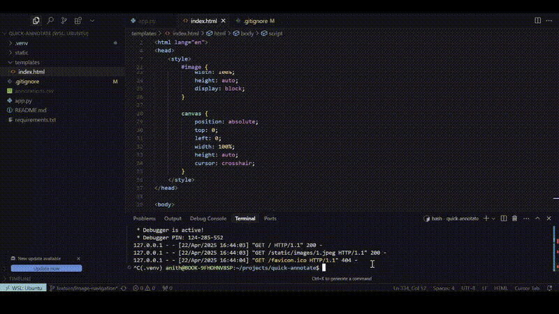

# Quick Annotate - Image bounding box annotaion tool using Flask

A lightweight browser-based image annotation tool built with Flask and vanilla JavaScript. Designed for fast and interactive labeling of vehicles (or any objects) using bounding boxes.

## Features

* Draw bounding boxes on static images
* Assign labels to each annotation (car, truck, bus, etc.)
* Label-specific color coded boxes
* Move and modify existing annotations
* Delete any existing annotations using 'Delete' key
* All annotations are saved to a csv file
* Unique ID tracking for each annotation to allow updates

## Tech Stack

**Frontend:** HTML, Canvas, Javascript (no frameworks)
**Backend:** Flask (Python)
**Storage:** CSV file (local, per-session)

## Setup & Run

### 1. Clone the Repo

```bash
git clone https://github.com/anithavedantam/quick-annotate
cd quick-annotate
```

### 2. Create a Virtual Environment

```bash
python -m venv .venv
source .venv/bin/activate
```

### 3. Install Dependencies

```bash
pip install -r requirements.txt
```

### 4. Run the App

```bash
python app.py
```

## Demo



## TODO (Next Features)

* Resize annotations by dragging the corners
* Support multiple images with navigation
* Save session/project state
* Export in COCO format
